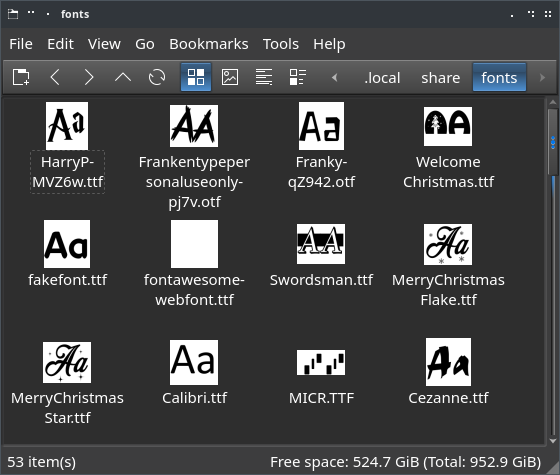

# fontThumb

Use your favorite file manager, such as PCManFM, to preview font files on Linux with this simple bash script.



One problem with desktop publishing on Linux is many of the fonts look the same. Scrolling through pages of similar fonts can be a pain. Use this tool to generate preview images. Then you can use file managers to trim down font selection or browse favorite fonts in a separate folder, such as `~/.local/share/fonts`.

## Get it from GitHub
 (clapping)
```
git clone https://github.com/themanyone/fontThumb.git
cd fontThumb
```

## Unnecessary?

If, at some later date, we already see font previews in file managers, distros have finally bundled a reliable solution. It seemed like font previews were working before. But it is unclear what packages provide it. It was very simple to do. So it is surprising that this is not a universal feature.

## Dependencies

This script requires [ImageMagick](https://imagemagick.org/index.php), which is probably available through your Distro's Package Manager.

Fedora, Centos.
`dnf install ImageMagick`

Ubuntu, Debian.
`dpkg -i ImageMagick`

Arch.
`pacman -S ImageMagick`

## Quick Install (swoosh)

Use the `inst.sh` script and log out of the desktop session (or reboot). Do not run with `sudo`.

## Problem?

Kubuntu, possibly a few other distros do not ship with [bubblewrap configured with permissions](https://duckduckgo.com/?q=Kubuntu+sandboxing+thumbnailers+with+bubblewrap) to run custom thumtnailers. Try installing `ffmpegthumbnailer` and see if that configures the thumbnailer functionality.

## Manual Install

Copy `fontThumb.sh` to somewhere in `$PATH`, such as `/bin`, `/usr/local/sbin`, or `~/.local/bin`.

```
echo $PATH
```

Remove the old thumbnails on the system.

`rm -rf ~/.cache/thumbnails/`

They might just work now. Or it may be necessary to log out of the desktop session, or reboot.

## Extending

Currently only TTF and OTF fonts are supported. But it's really easy to extend. Simply look up the mime type of your font in the `mime` directory and add it to `ttf.tumbnailer

`grep font /usr/share/mime/*`

Edit `~/.local/share/thumbnailers/ttf.tumbnailer` and add the mime type(s) separated by `;`. 

Refer to `https://specifications.freedesktop.org/shared-mime-info-spec/` for complete
mime documentation.

Then `rm -rf ~/.cache/thumbnails/` and log out, or reboot.

If ImageMagick understands the font, you should see new thumbnails for the font type.

## Author's links

    - GitHub https://github.com/themanyone
    - YouTube https://www.youtube.com/themanyone
    - Mastodon https://mastodon.social/@themanyone
    - Linkedin https://www.linkedin.com/in/henry-kroll-iii-93860426/
    - [TheNerdShow.com](http://thenerdshow.com/)

Copyright (C) 2024 Henry Kroll III, www.thenerdshow.com. See [LICENSE](LICENSE) for details.
